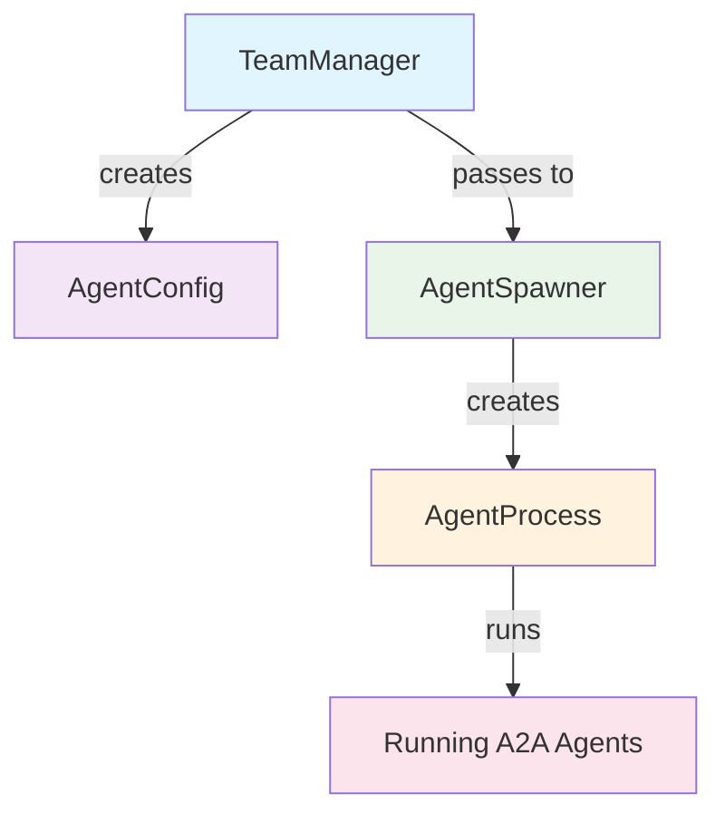

# Claude Code Team System - Architecture

## 📋 Core Classes

Four classes work together to create and manage AI agent teams.

---

## 🧠 **AgentConfig** (`team_manager.py:L12`)

**Purpose**: Data structure for single agent configuration.

**Contains**:
- Agent name and directory
- Host/port settings  
- Agent definition (CLAUDE.md content)
- Network configuration

---

## 🗂️ **TeamManager** (`team_manager.py:L23`)

**Purpose**: Parses team directory and creates `AgentConfig` objects.

**Process**:
```
samples/team/
├── config.yml      ← Central config
├── tom/CLAUDE.md   ← Agent definitions
├── jerry/CLAUDE.md
└── alice/CLAUDE.md
```

1. Reads `config.yml`
2. Scans agent directories
3. Loads `CLAUDE.md` files
4. Creates `AgentConfig` objects
5. Validates setup

---

## 🔄 **AgentProcess** (`agent_spawner.py:L148`)

**Purpose**: Manages single agent lifecycle with inline A2A logic.

**Architecture**:
```
AgentProcess
├── A2A Server (agent logic + Claude SDK)
└── HTTP Server (uvicorn - network transport)
```

**Manages**:
- A2A server creation
- HTTP server lifecycle
- Start/stop operations
- Asyncio task management

---

## 🎯 **AgentSpawner** (`agent_spawner.py:L217`)

**Purpose**: Orchestrates all `AgentProcess` instances.

**Orchestrates**:
- Team startup/shutdown
- Individual agent control
- Status monitoring
- Process management

---

## 🔗 **System Architecture**

### 📊 **Mermaid Diagram**


### 🔄 **Data Flow**
```
1. TeamManager parses directory
2. Creates AgentConfig objects
3. AgentSpawner receives configs
4. Creates AgentProcess instances
5. Each process starts A2A + HTTP servers
6. Agents accessible via HTTP API
```

### 🎯 **Class Matrix**

| Class | Role | Input | Output |
|-------|------|-------|--------|
| **AgentConfig** | Data container | - | Configuration data |
| **TeamManager** | Parser | Directory path | AgentConfig objects |
| **AgentProcess** | Process manager | AgentConfig | Running agent |
| **AgentSpawner** | Orchestrator | TeamManager | Team of agents |

---

## 🚀 **Runtime Example**

**Command**: `python misc/run_team.py samples/team`

**Result**:
```
📁 Loading team: samples/team
✅ Found 3 agents: tom, jerry, alice
🚀 Starting agents...
🎉 Team running!
🔗 Agents available:
   tom: http://localhost:8001
   jerry: http://localhost:8002
   alice: http://localhost:8003
```

**Behind the scenes**:
1. TeamManager → 3 AgentConfig objects
2. AgentSpawner → 3 AgentProcess instances  
3. AgentProcess → A2A + HTTP servers on ports 8001-8003

---

## 🏗️ **Benefits**

- **Separation of concerns**
- **Modular design**
- **Clean interfaces**
- **Scalable architecture**
- **Independent testing**

Clean, maintainable system for AI agent teams! 🎉
